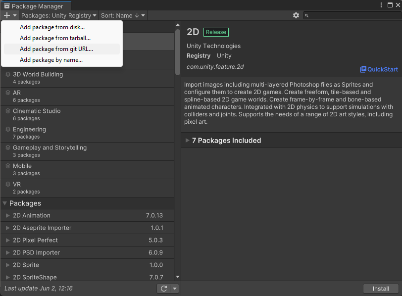
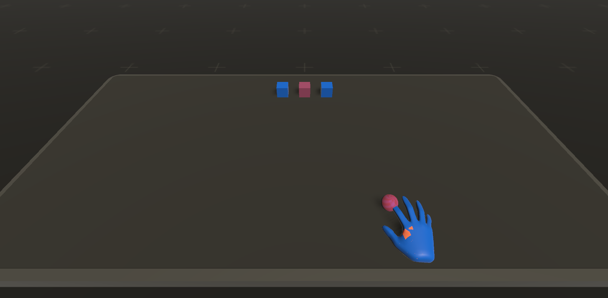

# Getting Started

Please Note: This toolkit started out as research code and it requires some considerable refinement, cleanup and documentation. Please bear with me as I might make some breaking changes.

## Installation

Import the package using Unity's Package Manager and the Git URL for this repository.

If you want to use specific platforms for the hand tracking (eg. Leap Motion, Meta/Oculus Quest), import the corresponding sample. See [Platform Support](./PLATFORMS.md) for information about platform specific dependencies.

HRTK recommends adding two custom layers which are used to control what the user can and can't see, so once the package is installed use the HRTK menu to add these layers.

## Basic Functionality

To see how a scene might be configured see the example scenes in HRTK/Examples/.

The basic idea is to have two types of object and hand in the scene "Tracked" and "Virtual". 

The "Tracked" versions of the hands and objects represents the real world. That is the tracked hands represent the hand tracking as provided by Leap Motion/Quest etc. hand tracking systems. Tracked targets the real haptic objects that the user will actually touch.

The "Virtual" version of thehands and objects represents what we want the user to see. That is, the virtual hand is the hand that is visually seen by the user during hand redirection, it is the hand which we manipulate the position of using a given offset. Virtual targets are the virtual objects that the user visually sees their hand touching. 

In the example scene, the tracked and virtual hands start in contact with the origin so they are aligned as shown by the Z-fighting between the orange (tracked) and blue (virtual) hands. There are also three virtual targets (blue cubes) and one tracked target (orange cube) that is the same shape and happens to be aligned with center virtual target making it slightly pink/purple rather than orange.

As we manually move the object called "Tracked Hand" toward the 'tracked' center cube, we can see the virtual hand automatically redirected to the virtual cube on the right.

Key things to note are:

- Every scene requires a Retargeting Manager which handles things like, which hand is dominant, which Tracked and Virtual targets exist in the scene, and provide access to the Retargeting Camera and Head position.
  - The Retargeting Camera should be attached to your VR camera in the scene. This specifically handles controlling what the user can and can't see by adjusting the LayerMask on the camera.

- Every hand (Left and/or Right) that will be affected by the redirection requires a Retargeting Controller which handles the specific Tracked and Virtual target for that hand at a given time.
  - Every Retargeting Controller requires at least a a Retargeting Offset Handler Virtual and Tracked hand, and a Retargeting Origin (the Origin can be shared between multiple hands if you want). 
  - The Retargeting Offset Handler is what actually manipulates the position of the hand based on the hand redirection and haptic retargeting algorithms.

- Every target in the scene needs either a VirtualTarget component or a TrackedTarget component.

- We provide a tool for configuring your "Retargeting Rig" which can automatically add and configure some elements of the scene. Go to the HRTK menu and click Build Retargeting Rig.
  - Step through the menu top to bottom populating fields and clicking buttons as they become available to configure your scene. 

