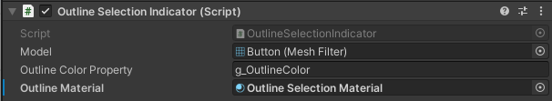

# Target Selection

## Setup

### Adding Selectors
For 'Head Gaze' pointer based target selection add the 'Head Pointer Selector' prefab to the main camera (usually 'CenterEyeAnchor' or similar). Head gaze selection only enables one target to be selected but it can be configured to set the target for either the left or right hand. If you want to set both, it is recommended to attach two head gaze pointers and adjust the visuals on them so they don't conflict.

For 'Hand' pointer based target selection, add the 'Hand Pointer Selector' prefab to the left and/or right **virtual** retargeting hands. Generally it makes sense to configure each selector to select the target for the corresponding hand. 

See 'Selector Settings' below for descriptions of each setting on the Selector components.

### Configuring Targets
For each virtual target you'll need to enable the 'Selectable' option so the target can be selected.

You should also add a visual indicator to show when the target is selected. Three different examples are provided:

- MeshColorSelectionIndicator: Sets the mesh colour when the target is selected.
- OutlineSelectionIndicator: Adds and outline and sets the colour of the outline when the target is selected.

- SpriteSelectionIndicator: Shows a different sprite when the target is selected/deselected.

On the Virtual Target, attach the selection indicator and ensure you have put the Tracked Target options under the Target Mapping list:

Ensure that the layer for your virtual target (eg. VirtualEnvironment) is included in the layer mask of the selector(s) you want to use, and that your virtual target object has a collider on it.

### Selector Settings

Below is an image of the Pointer Selector component (used for Hand Pointer selection), but very similar to the Head Gaze selector.

Working from top to bottom:

- Selector Enabled: Enables and disables the selector itself.
- Selection Enabled: Sets whether the selector is allowed to select targets.
- Target Layer Mask: Sets the layer mask, allowing or preventing selection of objects on certain layers.
- Manager: The RetargetingManager component in the scene.
- Hand: The RetargetingController hand to set the targets on. 
- On Targets Selected, OnTargets Deselected: Events for selection and deselection.
- Optimal Mapping Method:
  - Mapping Method: How the tracked target should be decided given the selected virtual target.
  - Optimisation Source: If Optimised is selected for mapping method, should the optimisation be calculated based on the origin or hand position.
  - Optimisation Factor: Which variable to try to optimise in the mapping.
- Target Filtering
  - Update Target Selectability: If true, the target selector dynamically sets whether a target is selectable based on the filter type.
  - Filter Type: Which method to use for filtering (eg. Static Threshold means a )
    - Require Origin: Require the user to return their hand to return to the origin.
    - Require Reset: Require the user to complete the reset attached under 'Intervening Reset'.
    - Static Threshold: Targets will become available for selection when the user's hand moves a fixed distance away.
    - Dynamic Threshold: Targets will become available if the user's hand moves a distance away calculated using the Adaptive Threshold technique from the 'Adaptive Reset Techniques' paper.
    - Live Angle/Translation/Combined: Targets will become available for selection if the angular or translational gain (or both) are within an acceptable cutoff limit.

- Dynamic Filtering: Parameters for dynamic filtering
  - Minimum Distance Cutoff: Targets are never selectable if the user's hand is within this distance.
  - Distance Cutoff: Cutoff for distance based methods (Static/Dynamic Threshold)
  - Angle Cutoff: Cutoff based on angular gain for Live Angle and Live Combined
  - Translation Cutoff:  Cutoff based on translational gain for Live Translation and Live Combined

- Intervening Reset:
  - Reset Method: The Reset the user is required to complete for 'Require Reset' target filtering.
  - On Reset Complete: Event for when the reset is completed.

- Ray Dwell Selection: Settings to configure the pointer, dwell times etc.