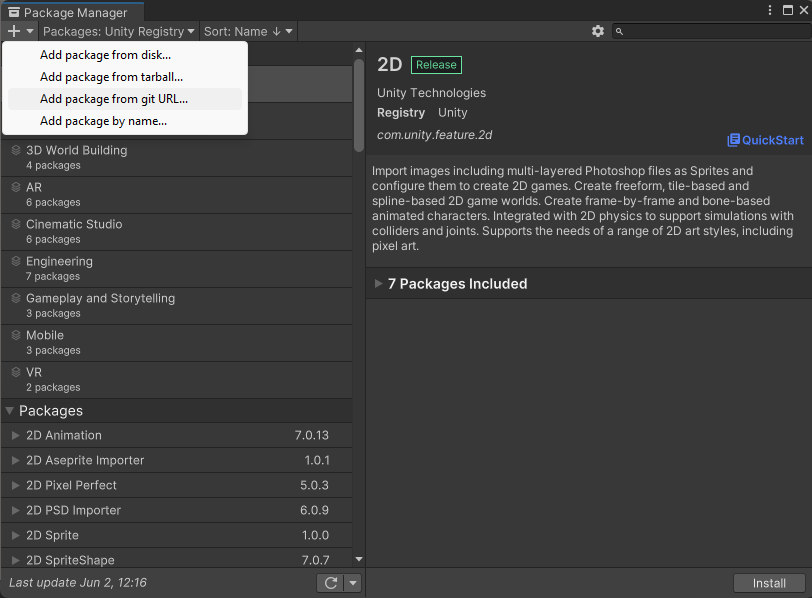
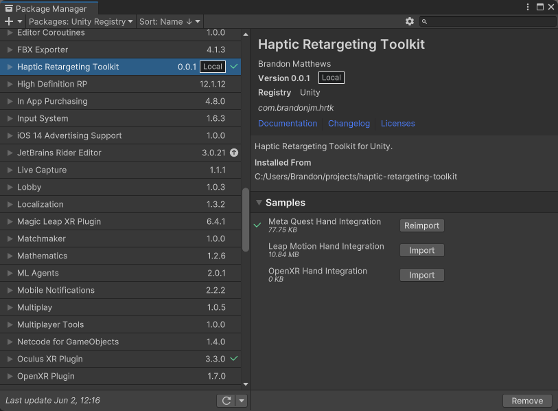
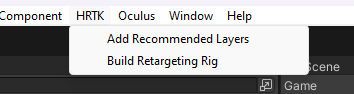
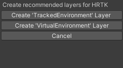
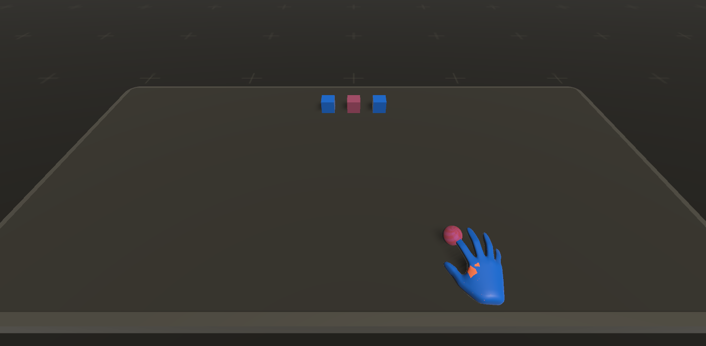
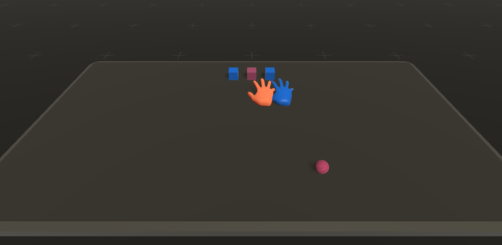

# Haptic Retargeting Toolkit

This is a toolkit for integrating haptic retargeting in immersive virtual and mixed reality experiences using 'hand redirection'. This was developed as part of my PhD research and thesis: [Dynamic Haptic Interfaces in Virtual Reality](https://find.library.unisa.edu.au/discovery/fulldisplay/alma9916843624701831/61USOUTHAUS_INST:ROR)

This toolkit is primarily aimed towards what is commonly called "Body Warp" haptic retargeting.

Please also check out [HaRT](https://github.com/AndreZenner/hand-redirection-toolkit), another toolkit with some additional warping methods included and support for blink based hand redirection. 

## Getting Started

Please Note: This toolkit started out as research code and it requires some considerable refinement, cleanup and documentation. Please bear with me as I might make some breaking changes.

### Installation

Import the package using Unity's Package Manager and the Git URL for this repository.

If you want to use specific platforms for the hand tracking (eg. Leap Motion, Meta/Oculus Quest), import the corresponding sample.

HRTK recommends adding two custom layers which are used to control what the user can and can't see, so once the package is installed use the HRTK menu to add these layers.

### Basic Functionality

To see how a scene might be configured see the example scenes in HRTK/Examples/.

The basic idea is to have two types of object and hand in the scene "Tracked" and "Virtual". 

The "Tracked" versions of the hands and objects represents the real world. That is the tracked hands represent the hand tracking as provided by Leap Motion/Quest etc. hand tracking systems. Tracked targets the real haptic objects that the user will actually touch.

The "Virtual" version of thehands and objects represents what we want the user to see. That is, the virtual hand is the hand that is visually seen by the user during hand redirection, it is the hand which we manipulate the position of using a given offset. Virtual targets are the virtual objects that the user visually sees their hand touching. 

In the example scene, the tracked and virtual hands start in contact with the origin so they are aligned as shown by the Z-fighting between the orange (tracked) and blue (virtual) hands. There are also three virtual targets (blue cubes) and one tracked target (orange cube) that is the same shape and happens to be aligned with center virtual target making it slightly pink/purple rather than orange.

As we manually move the object called "Tracked Hand" toward the 'tracked' center cube, we can see the virtual hand automatically redirected to the virtual cube on the right.

Key things to note are:

- Every scene requires a Retargeting Manager which handles things like, which hand is dominant, which Tracked and Virtual targets exist in the scene, and provide access to the Retargeting Camera and Head position.
  - The Retargeting Camera should be attached to your VR camera in the scene. This specifically handles controlling what the user can and can't see by adjusting the LayerMask on the camera.

- Every hand (Left and/or Right) that will be affected by the redirection requires a Retargeting Controller which handles the specific Tracked and Virtual target for that hand at a given time.
  - Every Retargeting Controller requires at least a a Retargeting Offset Handler Virtual and Tracked hand, and a Retargeting Origin (the Origin can be shared between multiple hands if you want). 
  - The Retargeting Offset Handler is what actually manipulates the position of the hand based on the hand redirection and haptic retargeting algorithms.

- Every target in the scene needs either a VirtualTarget component or a TrackedTarget component.

- We provide a tool for configuring your "Retargeting Rig" which can automatically add and configure some elements of the scene. Go to the HRTK menu and click Build Retargeting Rig.
  - Step through the menu top to bottom populating fields and clicking buttons as they become available to configure your scene. 

## Modules
Experimental functionality and platform specific integrations are broken out into modules so you can pick and choose which parts you want to integrate. These require additional plugins to be installed.

### Platform Integrations

 - [x] LeapMotion Integration
   - Additional Dependencies: 
      - [Ultraleap Unity Plugins](https://docs.ultraleap.com/xr-and-tabletop/xr/unity/getting-started/index.html) (Tested on version 6.9.0)
 - [x] Oculus/Meta Quest Integration
   - Additional Dependencies:
      - On Unity 2021.3: [Oculus Integration SDK (Legacy) v54](https://developers.meta.com/horizon/downloads/package/unity-integration/)
      - On Unity 2022 and later: [Meta Core SDK](https://developers.meta.com/horizon/documentation/unity/unity-project-setup#import-the-meta-xr-core-sdk)
 - [] OpenXR Hands Integration (WIP)

### Experimental Samples
- MaskWarp (Mixed Reality Haptic Retargeting)

## References
When using this repository please cite one or more of the following publications (as relevant):

### Bimanual Haptic Retargeting
B. J. Matthews, B. H. Thomas, S. Von Itzstein and R. T. Smith, "Remapped Physical-Virtual Interfaces with Bimanual Haptic Retargeting," 2019 IEEE Conference on Virtual Reality and 3D User Interfaces (VR), Osaka, Japan, 2019, pp. 19-27, doi: 10.1109/VR.2019.8797974.

### Shape Aware Haptic Retargeting
B. J. Matthews, B. H. Thomas, G. S. Von Itzstein and R. T. Smith, "Shape Aware Haptic Retargeting for Accurate Hand Interactions," 2022 IEEE Conference on Virtual Reality and 3D User Interfaces (VR), Christchurch, New Zealand, 2022, pp. 625-634, doi: 10.1109/VR51125.2022.00083.
 
### MaskWarp (Masked Retargeting)
B. J. Matthews, C. Reichherzer, B. H. Thomas and R. T. Smith, "MaskWarp: Visuo-Haptic Illusions in Mixed Reality using Real-time Video Inpainting," 2023 IEEE International Symposium on Mixed and Augmented Reality Adjunct (ISMAR-Adjunct), Sydney, Australia, 2023, pp. 767-768, doi: 10.1109/ISMAR-Adjunct60411.2023.00167.

### Adaptive Reset Techniques
B. J. Matthews, B. H. Thomas, G. S. Von Itzstein and R. T. Smith, "Adaptive Reset Techniques for Haptic Retargeted Interaction," in IEEE Transactions on Visualization and Computer Graphics, vol. 29, no. 2, pp. 1478-1490, 1 Feb. 2023, doi: 10.1109/TVCG.2021.3120410.

### Target Selection
B. J. Matthews and R. T. Smith. 2019. Head Gaze Target Selection for Redirected Interaction. In SIGGRAPH Asia 2019 XR (SA '19). Association for Computing Machinery, New York, NY, USA, 13–14. doi: 10.1145/3355355.3361883

## TODO:
- [] Improve documentation and commenting accross the board
- [] Test with newer Meta toolkits
- [] Support for Unity's XRHands
- [] Meta Quest passthrough support for Masked Retargeting
 
## License

MIT License

Copyright (c) 2023 Brandon Matthews

Permission is hereby granted, free of charge, to any person obtaining a copy
of this software and associated documentation files (the "Software"), to deal
in the Software without restriction, including without limitation the rights
to use, copy, modify, merge, publish, distribute, sublicense, and/or sell
copies of the Software, and to permit persons to whom the Software is
furnished to do so, subject to the following conditions:

The above copyright notice and this permission notice shall be included in all
copies or substantial portions of the Software.

THE SOFTWARE IS PROVIDED "AS IS", WITHOUT WARRANTY OF ANY KIND, EXPRESS OR
IMPLIED, INCLUDING BUT NOT LIMITED TO THE WARRANTIES OF MERCHANTABILITY,
FITNESS FOR A PARTICULAR PURPOSE AND NONINFRINGEMENT. IN NO EVENT SHALL THE
AUTHORS OR COPYRIGHT HOLDERS BE LIABLE FOR ANY CLAIM, DAMAGES OR OTHER
LIABILITY, WHETHER IN AN ACTION OF CONTRACT, TORT OR OTHERWISE, ARISING FROM,
OUT OF OR IN CONNECTION WITH THE SOFTWARE OR THE USE OR OTHER DEALINGS IN THE
SOFTWARE.
